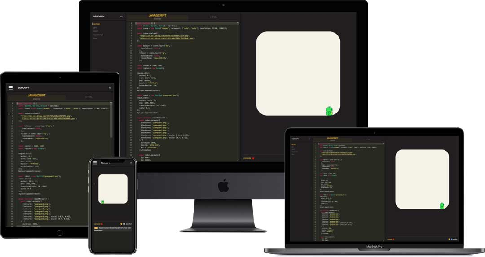

基于: demosify 项目,稍微修改了一下,增加了三级目录.节点过滤

👉🏻 [website](https://www.demosify.com) | 👉🏻 [online demo](https://demosify.github.io/demosify-demo/)

# DEMOSIFY

Create a playground to show the demos of your project.



## Quick start

1. install wccode-demo

```bash
npm install wccode-demo --save-dev
```

2. Create `.demosrc.js` file in your project root.

```js
module.exports = {
  name: 'YOUR PROJECT NAME',
}
```

3. Create `demos` directory in your project root. Add your demos in `demos` directory.

```bash
mkdir demos
mkdir demos/demo1
```

4. Create a `config.js` file in each of your demos, e.g. `demos/demo1`.

```js
// config.js
const javascript = `console.log('this is a demo')`;

export default {
  javascript,
}
```

5. Create a `.demoList.json` file in your `demos` directory. Specify all your demos show in sidebar.

```js
[
  "demo1",
  // ...
]
```
 多级,三级
```js
[
  {
    "label": "RawData",
    "src": "rawdata test"
  },
  {
    "group":"framework",
    "label": "framework",
    "src": "framework",
    "demos": [
      {
        "label": "Vue",
        "src": "vue test"
      },
      {
        "label": "React",
        "src": "react test"
      },
      {
        "group":"framework2",
        "label": "framework2",
        "src": "framework2",
        "demos": [
          {
            "label": "Vue2",
            "src": "vue test2"
          },
          {
            "label": "React2",
            "src": "react test2"
          }
        ]
      }
    ]
  }
]
```

6. Add NPM scripts in your `package.json`:

```json
  "scripts": {
    "demo:dev": "demosify --serve",
    "demo:prod": "demosify --prod"
  }
```

7. Run `npm run demo:dev`, visit `http://localhost:3030`. You will see the playground. ✌🏻

## Load sample files

You can load sample files though config.js.

```js
export default async () => {
  const [javascript, html, css] = await Promise.all([
    import('!raw-loader!./index.js'),
    import('!raw-loader!./index.html'),
    import('!raw-loader!./style.css'),
  ]);

  return {
    javascript,
    html,
    css,
  }
}
```

Add `index.js`, `index.html` and `style.css` files in your demo directory.

```js
console.log('This is a demo.');
```

```html
<!DOCTYPE html>
<html lang="en">
<head>
  <meta charset="UTF-8">
  <meta name="viewport" content="width=device-width, initial-scale=1.0">
  <meta http-equiv="X-UA-Compatible" content="ie=edge">
  <title>DEMO</title>
</head>
<body>
  <div id="app"></div>
</body>
</html>
```

```css
/* demo stylesheet */

body {
  background-color: red;
}
```

These files will be loaded to your playground.

## Deploy

Run `npm run demo:prod`.

All the demos will be deploy to production into `dist` directory of your project.

## Thanks to

Special thanks to [Poi](https://github.com/egoist/poi).

Demosify is inspired and powered by [Poi](https://poi.js.org/).
